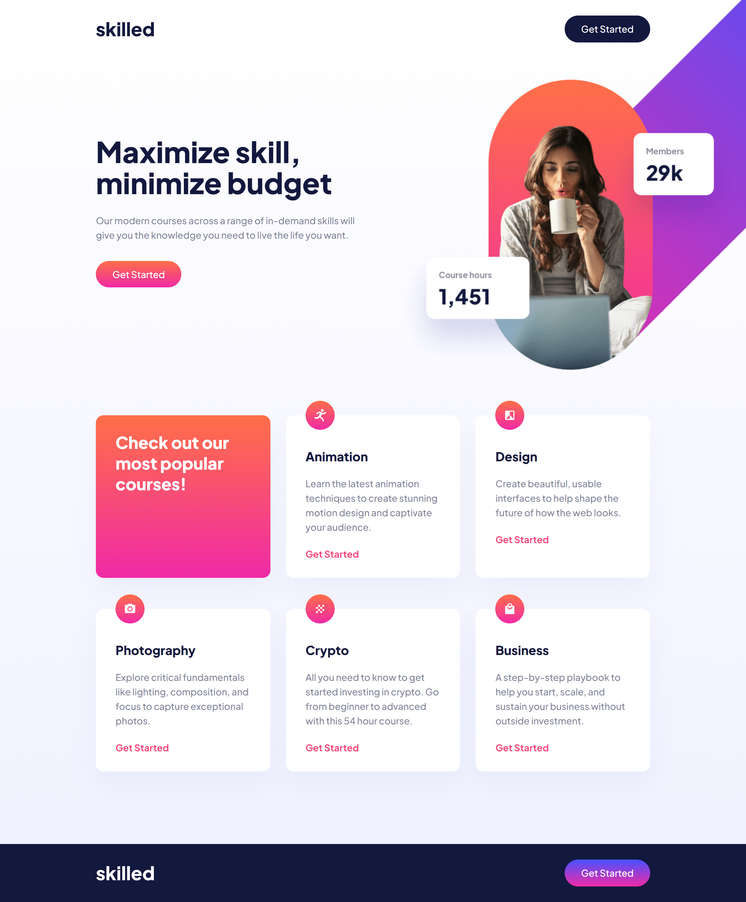

# Frontend Mentor - Skilled e-learning landing page solution

This is a solution to the [Skilled e-learning landing page challenge on Frontend Mentor](https://www.frontendmentor.io/challenges/skilled-elearning-landing-page-S1ObDrZ8q). Frontend Mentor challenges help you improve your coding skills by building realistic projects.

## Table of contents

- [Overview](#overview)
  - [The challenge](#the-challenge)
  - [Screenshot](#screenshot)
  - [Links](#links)
- [My process](#my-process)
  - [Built with](#built-with)
  - [What I learned](#what-i-learned)
  - [Useful resources](#useful-resources)
- [Author](#author)

### Screenshot

### Links

- Solution URL: [Frontend Mentor Solution](https://www.frontendmentor.io/challenges/skilled-elearning-landing-page-S1ObDrZ8q/hub/skilled-elearning-landing-page-vanilla-css-wr-dMF3Qk1)
- Live Site URL: [Live Site at Vercel](https://skilled-elearning-landing-page-seven.vercel.app/)
## My process

### Built with

- Semantic HTML5 markup
- Flexbox
- Grid
- Responsive Design
- CSS Animations
- Media queries

### What I learned

I learned how to use the property 'overflow'. I didn't know the concept of overflow before doing this challenge, so I struggled a lots to position the hero-image out of the container. 

### Useful resources

- [Overflow W3 Schools](https://www.w3schools.com/css/css_overflow.asp) - Overflow W3 Schools
- [Dealing With Hover on Mobile](https://www.youtube.com/watch?v=uuluAyw9AI0) - Dealing With Hover on Mobile

## Author
- Github - [correlucas](https://github.com/correlucas/)
- Frontend Mentor - [@correlucas](https://www.frontendmentor.io/profile/correlucas)
